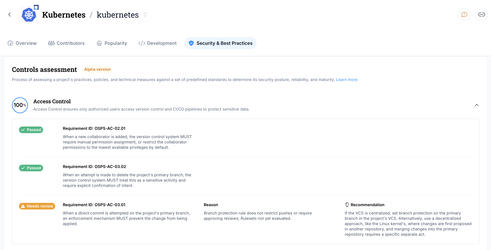

# Privateer Plugin for GitHub Repositories

This application performs automated assessments against GitHub repositories using controls defined in the [Open Source Project Security Baseline v2025.02.25](https://baseline.openssf.org). The application consumes the OSPS Baseline controls using [Gemara](https://github.com/gemaraproj/go-gemara) layer 2 and produces results of the automated assessments using layer 4.

Many of the assessments depend upon the presence of a [Security Insights](https://github.com/ossf/security-insights) file at the root of the repository, or `./github/security-insights.yml`.

## Work in Progress

Currently 43 control requirements across OSPS Baselines levels 1-3 are covered, with 9 not yet implemented. [Maturity Level 1](https://baseline.openssf.org/versions/2025-02-25.html#level-1) requirements are the most rigorously tested and are recommended for use. The results of these layer 1 assessments are integrated into [LFX Insights](https://insights.linuxfoundation.org/project/k8s/repository/kubernetes-kubernetes/security), powering the [Security & Best Practices results](https://insights.linuxfoundation.org/docs/metrics/security/).



Level 2 and Level 3 requirements are undergoing current development and may be less rigorously tested.

## Local Usage

To run the GitHub scanner locally, you will need the Privateer (`pvtr`) framework and the GitHub repository scanner (`pvtr-github-repo-scanner`) plugin.

1. Install pvtr using one of the methods described [here](https://github.com/privateerproj/privateer/blob/main/README.md#step-2-choose-your-installation-method).
2. Next, download the `pvtr-github-repo-scanner` plugin from the [releases](https://github.com/ossf/pvtr-github-repo-scanner/releases).

The following command is an example where the `pvtr`, the `pvtr-github-repo-scanner`, and the `config.yaml` are in the same directory.
```sh
./pvtr run --binaries-path .
```
If the binaries and the config files are in different directories specify the complete path using `--binaries-path` and `--config` flags.

You may have to adjust the plugin name in the config.yaml file to match them.

## AI-Assisted Checks

Most Baseline requirements can be answered by looking for something specific: a
file exists, a setting has a certain value. A few ask whether something is *good
enough* rather than whether it is *present*.

`OSPS-QA-06.02` asks whether a project documents when and how its tests are run.
Searching for the word "test" matches almost every repository and proves
nothing: "run the tests before submitting" leaves a contributor without a
command, and a `make test` snippet never says whether tests are expected on
every change or only at release time. Both mention testing; neither satisfies
the requirement.

For requirements like these, the scanner can optionally ask an AI model and
record its answer as evidence.

AI is **opt-in**. With no `ai_*` settings the scanner behaves exactly as it
always has, contacts no provider, and sends nothing anywhere.

### Configuration

<!-- markdownlint-disable MD013 -->

| Setting | Environment variable | Required | Default | Purpose |
| --- | --- | :---: | --- | --- |
| `ai_provider` | `PVTR_AI_PROVIDER` | yes | -- | Which AI service to use: `openai` or `anthropic`. |
| `ai_model` | `PVTR_AI_MODEL` | yes | -- | Model name, spelled the way your provider spells it. |
| `ai_api_key` | `PVTR_AI_API_KEY` | yes | -- | Your API key for that provider. |
| `ai_base_url` | `PVTR_AI_BASE_URL` | no | provider default | A different endpoint, such as a proxy or gateway. |
| `ai_timeout` | `PVTR_AI_TIMEOUT` | no | `30s` | How long to wait for one answer, for example `30s` or `2m`. |
| `ai_max_tokens` | `PVTR_AI_MAX_TOKENS` | no | `1024` | Longest answer to allow back from the model. |

<!-- markdownlint-enable MD013 -->

Put the settings at the top level so every service picks them up, or inside a
single service's `vars` block to apply them to just that service:

```yaml
ai_provider: openai
ai_model: gpt-4o-mini
# Pass the API key via PVTR_AI_API_KEY rather than writing it here.

services:
  my-scan:
    plugin: github-repo
    vars:
      owner: <github org or user name>
      repo: <github repo name>
      token: <classic token with permissions repo + admin:org>
```

### Reading The Results

A requirement answered with AI help is prefixed with `[AI-Assisted]`:

```text
[AI-Assisted] CONTRIBUTING.md tells contributors to run `go test ./...` before opening a pull request.
```

The model answers `Passed`, `Failed`, or `Needs Review`, with a confidence of
`low`, `medium`, or `high`. Anything unexpected — a malformed answer, a provider
error, a timeout, a missing API key — becomes `Needs Review` at low confidence
and the scan continues. **An AI-assisted check never silently passes a
requirement.**

The model's full reasoning, the exact question it was asked, the content it was
shown, and the model used are all saved as evidence in the results file, so a
reviewer can check or dispute the answer.

Three requirements use AI today: `OSPS-QA-06.02`, `OSPS-QA-06.03`, and
`OSPS-AC-04.02`. Each one makes at most one call to the provider per scan, and
only the specific documentation or workflow files a question needs are sent —
never the whole repository.

Note that repository content is sent to whichever provider you configure, and
that provider charges you for the calls.

For provider examples, where to put the settings, how to check a configuration
without paying for provider calls, size limits, and the full evidence format,
see [docs/ai-assisted-checks.md](docs/ai-assisted-checks.md).

## Docker Usage

```sh
# build the image
docker build . -t local
docker run \
  -v ./config.yml:/.privateer/config.yml \
  -v ./evaluation_results:/.privateer/bin/evaluation_results \
  local
```

## GitHub Actions Usage

See the [OSPS Security Baseline Scanner](https://github.com/marketplace/actions/open-source-project-security-baseline-scanner)

## Best Practices Badge Integration

To use scan results with the OpenSSF Best Practices Badge, see the user guide in
[docs/best-practices-badge.md](docs/best-practices-badge.md).

## Contributing

Contributions are welcome! Please see our [Contributing Guidelines](.github/CONTRIBUTING.md) for more information.

## License

This project is licensed under the Apache 2.0 License - see the [LICENSE](LICENSE) file for details.
